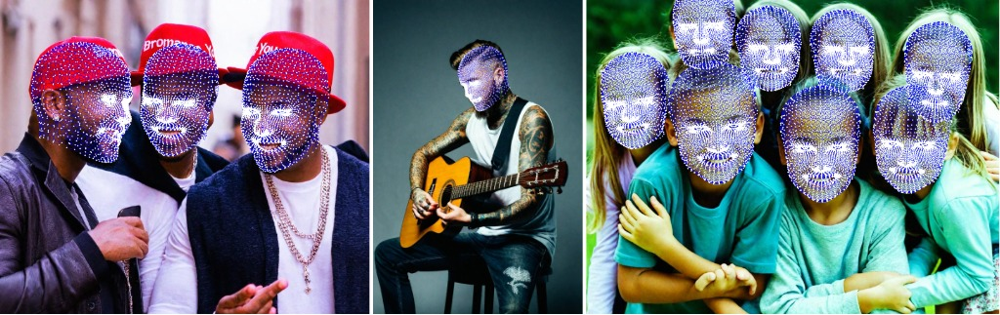

<div align="center">

# VGGHeads: A Large-Scale Synthetic Dataset for 3D Human Heads

[**Orest Kupyn**](https://github.com/KupynOrest)<sup>13</sup> · [**Eugene Khvedchenia**](https://github.com/BloodAxe)<sup>2</sup> · [**Christian Rupprecht**](https://chrirupp.github.io/)<sup>1</sup> ·

<sup>1</sup>University of Oxford · <sup>2</sup>Ukrainian Catholic University · <sup>3</sup>PiñataFarms AI

<a href='https://www.robots.ox.ac.uk/~vgg/research/vgg-heads/'></a>
<a href='https://arxiv.org/abs/2407.18245'></a>
<a href='https://huggingface.co/spaces/okupyn/vgg_heads'></a>
<a href='https://huggingface.co/okupyn/head-mesh-controlnet-xl'></a>
[](https://huggingface.co/okupyn/vgg_heads)

</div>

VGGHeads is a large-scale fully synthetic dataset for human head detection and 3D mesh estimation with over 1 million images generated with diffusion models. A model trained only on synthetic data generalizes well to real-world and is capable of simultaneous heads detection and head meshes reconstruction from a single image in a single step.



## Installation

#### Create a Conda virtual environment

```bash
conda create --name vgg_heads python=3.10
conda activate vgg_heads
```

#### Clone the project and install the package

```bash
git clone https://github.com/KupynOrest/head_detector.git
cd head_detector

pip install -e ./
```

Or simply install

```bash
pip install git+https://github.com/KupynOrest/head_detector.git
```

## Usage

To test VGGHeads model on your own images simply use this code:

```python
from head_detector import HeadDetector
import cv2
detector = HeadDetector()
image_path = "your_image.jpg"
predictions = detector(image_path)
# predictions.heads contain a list of heads with .bbox, .vertices_3d, .head_pose params
result_image = predictions.draw() # draw heads on the image
cv2.imwrite("result.png",result_image) # save reuslt image to preview it.
```

## Gradio Demo

We also provide a Gradio <a href='https://github.com/gradio-app/gradio'></a> demo, which you can run locally:

```bash
cd gradio
pip install -r requirements.txt
python app.py
```
You can specify the `--server_port`, `--share`, `--server_name` arguments to satisfy your needs!

## Training

Coming soon

## News

- [2024/08/09] 🔥 We release VGGHeads_L Checkpoint and [Mesh ControlNet](https://huggingface.co/okupyn/head-mesh-controlnet-xl)
- [2024/07/26] 🔥 We release the initial version of the codebase, the paper, project webpage and an image demo!!

## Cite

If you find VGGHeads useful for your research and applications, please cite us using this BibTeX:

```bibtex
@article{vggheads,
      title={VGGHeads: A Large-Scale Synthetic Dataset for 3D Human Heads},
      author={Orest Kupyn and Eugene Khvedchenia and Christian Rupprecht},
      year={2024},
      eprint={2407.18245},
      archivePrefix={arXiv},
      primaryClass={cs.CV},
      url={https://arxiv.org/abs/2407.18245},
}
```

 [![CC BY-NC 4.0][cc-by-nc-shield]][cc-by-nc]

This work is licensed under a
[Creative Commons Attribution-NonCommercial 4.0 International License][cc-by-nc].

[![CC BY-NC 4.0][cc-by-nc-image]][cc-by-nc]

[cc-by-nc]: https://creativecommons.org/licenses/by-nc/4.0/
[cc-by-nc-image]: https://licensebuttons.net/l/by-nc/4.0/88x31.png
[cc-by-nc-shield]: https://img.shields.io/badge/License-CC%20BY--NC%204.0-lightgrey.svg
